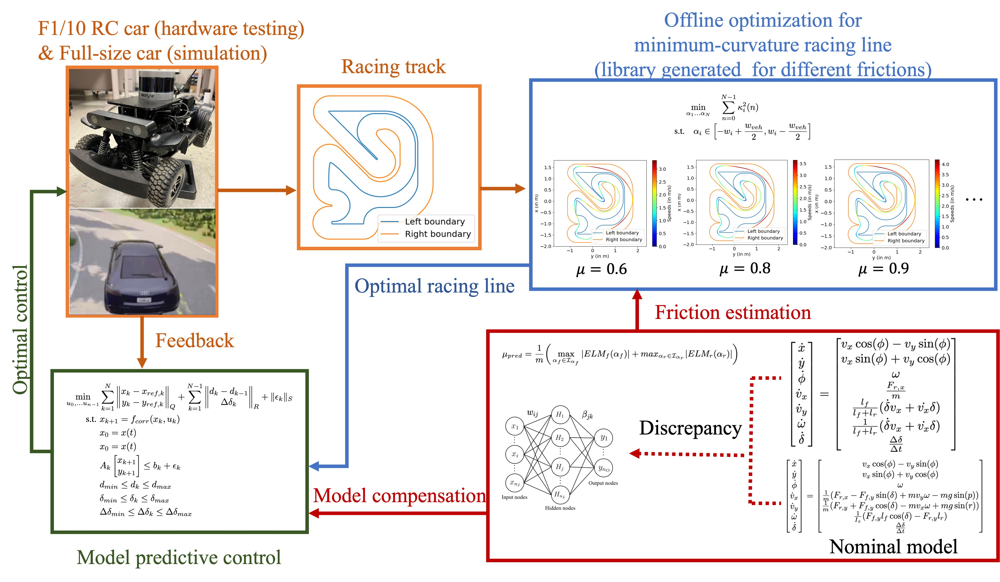

# APACRace

Code for Adaptive Planning and Control with Time-Varying Tire Models for Autonomous Racing Using Extreme Learning Machine ([Website](https://dvij542.github.io/apacrace/)) ([Paper](https://arxiv.org/abs/2303.08235))
NOTE: Well formatted and cleaned version of the code will be available soon

## Overview 



## Installation
We recommend creating a new [conda](https://docs.conda.io/en/latest/) environment:

```
conda create --name apacrace python=3.6
conda activate apacrace
```
Then install APACRace:

```
git clone https://github.com/dvij542/APACRace-Code.git
cd APACRace-Code/
pip install -e .
```

## How to run online learning based controller (APACRace)
The following steps are explained for the [1:43 scale autonomous racing platform](https://arxiv.org/abs/1711.07300) at ETH Zurich. We also provide code for the 1:10 scale [F1TENTH](http://f1tenth.org/) racing platform at University of Pennsylvania.

1. (Optional, generated raceline is in repo) Compute the racing line for the track we want to race on.
	```
	cd apacrace/raceline
	python generate_raceline_ethz.py
	```

2. (Optional, generated raceline library is in repo) Render speeds along the raceline for different tire friction limits by running :-
    ```
    python render_speeds.py
    ```

3. Run APACRace (MLP predictor for tire forces learned online) controller with the generated offline library of racelines as reference as follows:-
	```
	cd mpc
	python run_nmpc_online_semi_mlp.py
	```

4. (optional) Run the following optionally for comparison:-
	a. Full dynamics learning with MLP: run_nmpc_online_mlp.py
	b. Using Gaussian Process (GP) for model correction: run_nmpc_online_gp.py
	c. Dynamic model with known parameters (Oracle): run_nmpc_true.py 
	d. E-kinematic model with no learning: run_nmpc_ekin.py

## How to run offline GP-based controller (BayesRace)
The following steps are explained for the [1:43 scale autonomous racing platform](https://arxiv.org/abs/1711.07300) at ETH Zurich. We also provide code for the 1:10 scale [F1TENTH](http://f1tenth.org/) racing platform at University of Pennsylvania.

1. Compute the racing line for the track we want to race on.
	```
	cd apacrace/raceline
	python generate_raceline_ethz.py
	```
	<!-- <p align="center">
	
	</p> -->

2. Run a pure pursuit controller on a different track to log sensor measurements and state estimates. This data resemble true system dynamics.
	```
	cd apacrace/pp
	python run_pp_orca.py
	```
	<!-- <p align="center">
	
	</p> -->

3. Given a trajectory of states from Step 2, generate an equivalent trajectory using a simpler and easy-to-tune e-kinematic model.
	```
	cd apacrace/data
	python simulate_kinematic_orca.py
	```

4. Train Gaussian process models to predict mismatch between true system dynamics from Step 2 and e-kinemtic model from Step 3.
	```
	cd apacrace/gp
	python train_model_orca.py
	```

5. Validate the trained models on the track we want to race.
	```
	cd apacrace/gp
	python plot_uncertainty_orca.py
	```
	<!-- <p align="center">
	
	</p> -->

6. Run MPC with and without GP correction. By default boundary constraints are turned off for faster execution.
	```
	cd apacrace/mpc
	python run_nmpc_orca_gp.py
	```
	MPC without GP correction is shown on the left, and with GP correction on the right.
	<!-- <p align="center">
	
	
	</p> -->

7. Benchmark the performance in Step 6 against MPC with true model dynamics.
	```
	cd apacrace/mpc
	python run_nmpc_orca_true.py
	```
	<!-- <p align="center">
	
	</p> -->

8. Finally, update the GP models using data collected in Step 6 that is specific to the racing track and re-run MPC with the updated GP models.
	```
	cd apacrace/gp
	python update_model_orca.py
	```

	```
	cd apacrace/mpc
	python run_nmpc_orca_gp_updated.py
	```

	<!-- <p align="center">
	
	</p> -->
